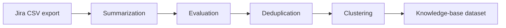

# NCSA Ticket Ingest

Scripts for turning Jira support ticket exports into sanitized question-and-answer pairs suitable for indexing in a RAG knowledge base (for example, an MCP server).

Tickets are exported from Jira as CSV, then processed on a Slurm GPU node via [llmflux](https://github.com/ncsa/llmflux) and `vllm`. Each stage uses a system prompt under `prompts/` to steer the model. The pipeline strips or generalizes PII and collapses redundant Q/A pairs before downstream indexing.

## Workflow



| Stage | Module | Purpose |
|-------|--------|---------|
| 1. Summarization | `src/stages/summarization.py` | Read tickets from CSV; submit batch LLM jobs to produce one Q/A pair per ticket. |
| 2. Evaluation | `src/stages/evaluation.py` | Check summarization output for remaining PII and report failure rate. |
| 3. Deduplication | `src/stages/deduplication.py` | Identify duplicate topics and keep one Q/A per topic. |
| 4. Clustering | `src/stages/clustering.py` | Group related Q/A pairs into topics (in progress). |

Each LLM stage builds a `.jsonl` prompt file, submits a Slurm job through llmflux, and waits for completion. Intermediate prompt files are written next to the stage input/output paths.

## Directory layout

```
ticket-ingest/
├── ticket_pipeline.py      # Run all stages in sequence
├── requirements.txt
├── config/
│   └── slurm_config.json     # Slurm account, partition, model, batch size
├── prompts/
│   ├── summarization.md
│   ├── evaluation.md
│   ├── deduplication.md
│   └── clustering.md
├── data/
│   ├── raw/                  # Jira CSV exports
│   ├── input/                # Optional intermediate files
│   └── output/               # LLM results and deduplicated JSON
├── logs/
└── src/
    ├── log_utils.py
    ├── llmflux_utils.py      # Slurm + llmflux job helpers
    └── stages/               # Per-stage implementations
```

Run all commands from the `ticket-ingest` directory so relative paths to `config/`, `prompts/`, and `data/` resolve correctly.

## Setup

```bash
cd NCSA/ticket-ingest
python -m venv .venv
source .venv/bin/activate
pip install -r requirements.txt
```

You need access to a Slurm cluster with GPU partitions and a working llmflux installation. Edit `config/slurm_config.json` for your account, partition, time limit, memory, and default model:

```json
{
    "account": "your-slurm-account",
    "partition": "gpuA100x4",
    "time": "06:00:00",
    "mem": "32GB",
    "gpus_per_node": 1,
    "nodes": 1,
    "cpus_per_task": 8,
    "model": "Qwen3-8B",
    "batch_size": 4
}
```

Command-line `-m` / `--model` and `-b` / `--batch-size` override the config file when provided.

## Input format

Summarization expects a **Jira CSV export** (place files under `data/raw/`). The reader uses these columns:

- `Summary` — ticket title
- `Description` — ticket body
- `Comment` — first comment column
- `Comment.1`, `Comment.2`, … — additional comment columns (read until the first missing column)

Other columns are ignored. All fields are read as strings.

Example:

```bash
# Export from Jira, then:
cp /path/to/export.csv data/raw/Delta-25.csv
```

## Running the full pipeline

```bash
python ticket_pipeline.py data/raw/Delta-25.csv
```

Common options:

| Option | Description |
|--------|-------------|
| `data` | (required) Path to the Jira CSV file |
| `-c`, `--slurm-config` | Slurm config JSON (default: `config/slurm_config.json`) |
| `-o`, `--output` | Declared final output path (default: `data/output/ticket_pipeline_results.jsonl`) |
| `-m`, `--model` | Override model from config |
| `-b`, `--batch-size` | Override batch size from config |
| `--log-file` | Log file path (default: `logs/Latest.log`) |
| `-v`, `--verbose` | DEBUG logging |

The orchestrator runs summarization → evaluation → deduplication → clustering, loading the matching prompt from `prompts/` for each stage. Per-stage outputs use the CSV basename as a label (for example, `Delta-25`).

## Running stages individually

Stages are Python packages; invoke them as modules from `ticket-ingest`:

```bash
# 1. Summarization
python -m src.stages.summarization data/raw/Delta-25.csv \
  -o data/output/Delta-25_summarization_results.jsonl

# 2. Evaluation (input is summarization JSON from llmflux)
python -m src.stages.evaluation data/output/Delta-25_summarization_results.jsonl \
  -o data/output/Delta-25_evaluation_results.jsonl

# 3. Deduplication
python -m src.stages.deduplication data/output/Delta-25_summarization_results.jsonl \
  -o data/output/Delta-25_deduplicated_results.jsonl
```

Each stage accepts `-c` / `--slurm-config`, `-p` / `--prompt`, `-m`, `-b`, `--log-file`, and `-v` where applicable. If `-o` is omitted, outputs default under `data/output/` with a name derived from the input file.

Do **not** run stage files as `python src/stages/summarization.py`; use `python -m src.stages.<stage>` so package imports resolve.

## LLM backend and artifacts

- **Engine:** [llmflux](https://github.com/ncsa/llmflux) with `vllm` on Slurm.
- **Job workspace:** `.llmflux/` under the current working directory (logs, data, models, tmp, containers).
- **Summarization output:** JSON array of llmflux batch results (despite `.jsonl` extensions in some paths). Downstream stages load this with `json.load`.
- **Deduplication output:** JSON array of unique `{custom_id, content}` objects written to the path given by `-o`.
- **Evaluation:** After the job finishes, writes `evaluation_failures.json` in the working directory with any responses that failed PII checks.

List available models:

```bash
llmflux --show-models
```

## PII handling

Summarization and evaluation prompts require the model to generalize user-specific details and replace identifiers with placeholders. This was tested on a sample of NCSA Delta tickets with Qwen3-8B; a small fraction of outputs may still need manual review.

See `prompts/summarization.md` and `prompts/evaluation.md` for the exact policies passed to the model.

## Notes

- Stages block until the submitted Slurm job completes (`monitor_llmflux_job` polls `squeue`).
- Clustering (`src/stages/clustering.py`) is not fully implemented yet; the pipeline calls it, but the stage body is still a stub.
- `ticket_pipeline.py` wires fixed paths for the deduplication and clustering inputs in some cases; when debugging, prefer running stages individually with explicit `-o` / input paths.

## TODO

- [ ] Finish clustering stage implementation
- [ ] Align `ticket_pipeline.py` intermediate paths with per-label outputs from earlier stages
- [ ] Add support for ticket attachments
